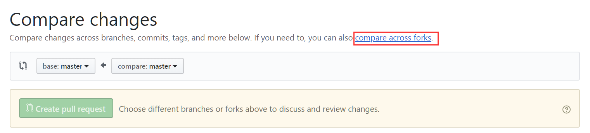
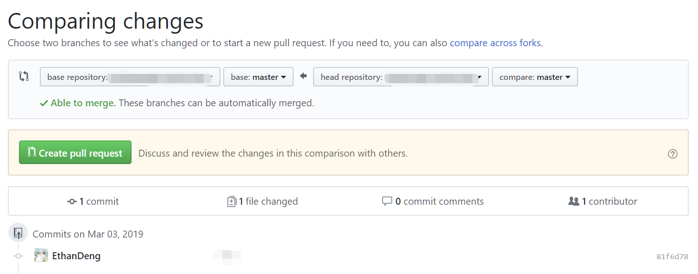

# 简介

本文介绍如何配置 Visual Studio Code 作为 LaTeX 的编辑器。

欢迎提交 issues 和 pull requests。

## 如何提交 pull request?

首先，你需要把本仓库 fork 到你自己目录下，然后在本地

```shell
git clone https://github.com/<Your Name>/vscode-latex.git
```

在经过修改之后，你可以通过

```shell
git add .
git commit -m "your commit message"
git push -u origin master
```
把本地修改传到你的远端服务器目录下，然后再回到 [github@EthanDeng:vscode-latex](https://github.com/EthanDeng/vscode-latex/pulls)，通过 Github 页面提交 pull requests。具体的操作如下：

首先，找到绿色的 `New pull requests` 按钮并点击，然后点击下图中的 `compare across forks`



确认你要提交的内容



在上图中，其中 `base repository` 是你要提交的原库，在我们这个例子中就是 `EthanDeng/vscode-latex` ，而 `head repository` 就是你自己的仓库，也就是 `<your name>/vscode-latex`，你可以通过比较文件的差异，确认无误之后，点击绿色的 `Create pull request` 即可。


## 修改须知

### 字体

请自行安装方正系列字体（个人，商业均免费）和 Libertinus 系列字体：

+ [方正书宋简体](http://www.foundertype.com/index.php/FontInfo/index.html?id=151)
+ [方正楷体简体](http://www.foundertype.com/index.php/FontInfo/index.html?id=137)
+ [方正黑体简体](http://www.foundertype.com/index.php/FontInfo/index.html?id=131)
+ [Libertinus 系列](https://github.com/libertinus-fonts/libertinus)：（Libertinus Serif，Libertinus Sans）

### 代码高亮

由于本文件代码高亮使用了 `minted` 宏包，所以你需要自行安装 Python 和 pygments 包（ pip install pygments ），另外因为使用了 minted 宏包，所以需要添加 `--shell-escape`  选项进行编译。完整的编译方式是

```tex
xelatex --shell-escape main.tex
```

注意： 由于我自定义了⼀个 `minted` 样式，所以，你如果要修改，请把下面语句注释掉：

```tex
\usemintedstyle{elegant}
```
